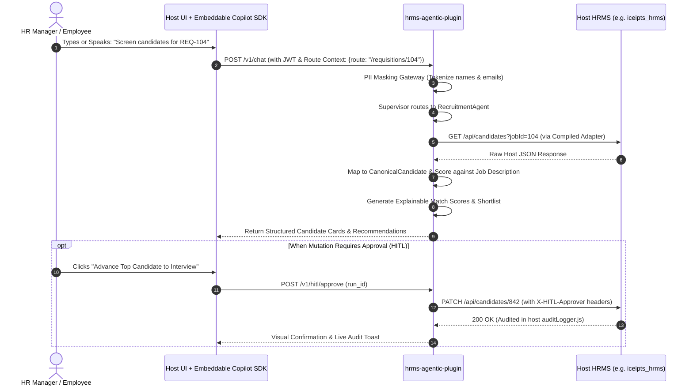

# Enterprise Agentic HRMS AI Plugin: Phase-Wise Implementation Plan

## Document Metadata
* **Document**: `PHASE_WISE_PLAN.md`
* **Repository**: `hrms-agentic-plugin` (Standalone Product & Sidecar Microservice)
* **Design Philosophy**: 100% Host-Agnostic, Zero-Touch Integration, Autonomous Dynamic Schema Adaptation
* **Target Host Platforms**: `iceipts_hrms`, Frappe/ERPNext, BambooHR, Darwinbox, Workday, Custom REST
* **Version**: 1.0.0-PROD
* **Status**: Approved for Engineering Execution

---

## Table of Contents
1. [Product Overview & Architectural Boundary](#1-product-overview--architectural-boundary)
2. [Communication & Protocol Specification](#2-communication--protocol-specification)
3. [The 5-Stage Dynamic Schema Engine](#3-the-5-stage-dynamic-schema-engine)
4. [Phase-by-Phase Engineering Roadmap](#4-phase-by-phase-engineering-roadmap)
   - [Phase 1: Standalone Scaffolding & Dynamic Schema Core](#phase-1-standalone-scaffolding--dynamic-schema-core)
   - [Phase 2: Universal REST Connector & Runtime Engine](#phase-2-universal-rest-connector--runtime-engine)
   - [Phase 3: Multi-Agent Fleet & Statutory Legal RAG](#phase-3-multi-agent-fleet--statutory-legal-rag)
   - [Phase 4: Zero-Trust Governance & Host Audit Attribution](#phase-4-zero-trust-governance--host-audit-attribution)
   - [Phase 5: Embeddable Frontend Copilot SDK & HITL UI](#phase-5-embeddable-frontend-copilot-sdk--hitl-ui)
   - [Phase 6: The 5-Tier Testing Pyramid & Production Hardening](#phase-6-the-5-tier-testing-pyramid--production-hardening)
5. [The 5-Tier Production Quality Pyramid](#5-the-5-tier-production-quality-pyramid)
6. [Distribution & Deployment Topologies](#6-distribution--deployment-topologies)
7. [Production Readiness & Acceptance Checklist](#7-production-readiness--acceptance-checklist)

---

## 1. Product Overview & Architectural Boundary

The **`hrms-agentic-plugin`** is an independent, host-agnostic intelligence microservice designed to make **any existing HRMS agentic** without requiring code changes to the host application.

```
┌──────────────────────────────────────────────────────────────────────────────────┐
│                   CUSTOMER'S HRMS (System of Record - Untouched)                  │
│       [iceipts_hrms | Frappe | BambooHR | Workday | Custom In-House REST]        │
│          • Relational DB  • Standard REST Endpoints  • Core HR Business Logic    │
└────────────────────────────────────────┬─────────────────────────────────────────┘
                                         │ HTTPS / Webhooks / OAuth2
┌────────────────────────────────────────▼─────────────────────────────────────────┐
│              STANDALONE REPOSITORY: `hrms-agentic-plugin` (Sidecar)               │
│                                                                                  │
│   ┌──────────────────────────────────────────────────────────────────────────┐   │
│   │ 1. Dynamic Schema Engine                                                 │   │
│   │    • OpenAPI 3.x / Swagger 2.0 & JSON Sample Harvester                   │   │
│   │    • Semantic Synthesizer (Host Schema ➔ Canonical Domain Models)        │   │
│   │    • Shadow Verification Prober & Quality Grader                         │   │
│   │    • Sub-millisecond Compiled Runtime FieldMap Cache                     │   │
│   └──────────────────────────────────────────────────────────────────────────┘   │
│                                        │                                         │
│   ┌────────────────────────────────────▼─────────────────────────────────────┐   │
│   │ 2. Cognitive Agent Fleet & Supervisory Brain                             │   │
│   │    • Supervisor Agent & 14 Domain Specialists (Recruitment, Leave, etc.) │   │
│   │    • Multi-Jurisdiction Statutory Legal RAG (IN, AE, SA, US)             │   │
│   │    • Autonomous Diff & Patch Generator                                  │   │
│   └──────────────────────────────────────────────────────────────────────────┘   │
│                                        │                                         │
│   ┌────────────────────────────────────▼─────────────────────────────────────┐   │
│   │ 3. Enterprise Governance & Security Boundary                             │   │
│   │    • Dynamic PII Masking & Vault Tokenization                            │   │
│   │    • Human-In-The-Loop (HITL) Gate (Quorum, Separation of Duties)        │   │
│   │    • Append-Only Audit Trail & Action Attribution Headers                │   │
│   └──────────────────────────────────────────────────────────────────────────┘   │
│                                        │                                         │
│   ┌────────────────────────────────────▼─────────────────────────────────────┐   │
│   │ 4. Serving Surfaces & Embeddable SDK                                     │   │
│   │    • REST / WebSocket API (`/v1/chat`, `/v1/schema`, `/v1/remediate`)   │   │
│   │    • Model Context Protocol (MCP) Server (for Claude, Cursor, Copilot)   │   │
│   │    • Embeddable Frontend Copilot SDK (Web Component / Script Tag)        │   │
│   └──────────────────────────────────────────────────────────────────────────┘   │
└──────────────────────────────────────────────────────────────────────────────────┘
```

### Key Operating Invariants:
1. **Zero Database Disruption**: The plugin connects via standard REST endpoints and webhooks; it never issues direct SQL queries to the customer's production database.
2. **Deterministic Writes**: Write mutations (e.g. updating employee profiles, adjusting leave balances, posting requisitions) never rely on unconstrained LLM runtime guessing; they execute via compiled, verified `FieldMap` adapters.
3. **Statutory Mathematical Precision**: Calculations for payroll, wage protection, tax withholdings, and overtime are performed via Python `Decimal` engines rather than generative text approximations.
4. **Non-Repudiation**: Every agent-initiated mutation carries explicit attribution headers detailing the agent run ID, the human approver ID, and the cryptographic hash of the reasoning trace.

---

## 2. Communication & Protocol Specification

Because this is a standalone product, all boundaries are mediated over standard network protocols:



---

## 3. The 5-Stage Dynamic Schema Engine

To adapt to any HRMS without code modification, the plugin runs a 5-stage discovery and runtime compilation lifecycle:

1. **Stage 1 (Perception)**: `SchemaIntrospector` scans OpenAPI/Swagger specs or harvests 5–10 sample JSON records from host endpoints. It infers field names, types (`string`, `number`, `boolean`, `date`, `datetime`, `array`, `object`), nullability, and enums.
2. **Stage 2 (Cognition)**: `MappingSynthesizer` aligns discovered host fields with Canonical Domain Models (`CanonicalEmployee`, `CanonicalLeaveRequest`, `CanonicalRequisition`, etc.) using semantic matching, token normalization, and synonym dictionaries.
3. **Stage 3 (Verification)**: `ShadowProber` executes dry-run transformations on harvested samples, checking for nullability violations, type coercion failures, and missing primary keys.
4. **Stage 4 (HITL Review)**: Generates a visual review card displaying confidence scores (e.g., `emp_doj` ➔ `joining_date` [98%]) and prompts the admin to confirm ambiguous mappings.
5. **Stage 5 (Deterministic Execution)**: Compiles the confirmed mapping into high-speed declarative `FieldMap` objects cached in memory for sub-millisecond runtime execution.

---

## 4. Phase-by-Phase Engineering Roadmap

```
┌─────────────────────────────────────────────────────────────────────────────────────────────────┐
│                     6-PHASE ROADMAP: STANDALONE `hrms-agentic-plugin`                           │
├──────────┬───────────────────────────────────────┬──────────────────────────────────────────────┤
│ Phase 1  │ Standalone Scaffolding & Dynamic Core │ Introspector, Canonical Models, Synthesizer   │
├──────────┼───────────────────────────────────────┼──────────────────────────────────────────────┤
│ Phase 2  │ Universal REST Connector & Runtime    │ Dynamic REST Client, Concurrency & Idempotency│
├──────────┼───────────────────────────────────────┼──────────────────────────────────────────────┤
│ Phase 3  │ Multi-Agent Fleet & Statutory RAG     │ Supervisor, 14 Domain Agents, Labor Gazettes  │
├──────────┼───────────────────────────────────────┼──────────────────────────────────────────────┤
│ Phase 4  │ Zero-Trust Governance & Security      │ PII Masking, Vault Tokens, Audit Integration  │
├──────────┼───────────────────────────────────────┼──────────────────────────────────────────────┤
│ Phase 5  │ Embeddable Frontend Copilot SDK       │ Web Component, Shadow DOM, PostMessage sync   │
├──────────┼───────────────────────────────────────┼──────────────────────────────────────────────┤
│ Phase 6  │ The 5-Tier Testing Pyramid & CI/CD    │ Unit, Contract, Invariant, Drift, Playwright  │
└──────────┴───────────────────────────────────────┴──────────────────────────────────────────────┘
```

---

### Phase 1: Standalone Scaffolding & Dynamic Schema Core

#### Objectives
Initialize the standalone repository, establish build tooling (UV/Poetry, pre-commit, Ruff), and implement the autonomous schema adaptation engine.

#### Deliverables & Module Breakdown
1. **Repository Scaffolding**:
   - `pyproject.toml`: Modern Python 3.11+ configuration with UV/Poetry.
   - `.github/workflows/ci.yml`: Automated linting, type-checking (Pyright/Mypy), and test runners.
   - `deploy/Dockerfile`: Multi-stage distroless production container.
2. **`hrms_plugin/schema/introspector.py`**:
   - OpenAPI 3.x and Swagger 2.0 parser (YAML & JSON).
   - Black-box JSON sample harvester with type inference (`FieldDataType`).
   - Primary key and enum candidate heuristic detectors.
3. **`hrms_plugin/schema/canonical.py`**:
   - Universal domain entities: `CanonicalEmployee`, `CanonicalLeaveRequest`, `CanonicalRequisition`, `CanonicalCandidate`, `CanonicalPunch`, `CanonicalAsset`.
4. **`hrms_plugin/schema/synthesizer.py`**:
   - Semantic alignment engine with compound name handling (`first_name` + `last_name` ➔ `full_name`).
   - Automatic enum translation matching (e.g. host `APPROVED` ➔ canonical `OPEN`).
5. **`hrms_plugin/schema/prober.py`**:
   - Pre-flight verification prober generating structured `ProbeReport` with quality scoring (0.0 to 1.0).

#### Phase 1 Verification Gate
* **Test Suite**: `tests/unit/test_schema_introspector.py`, `tests/unit/test_synthesizer.py`, `tests/unit/test_prober.py`.
* **Benchmark**: Test against real-world `iceipts_hrms` OpenAPI spec (`swagger.yaml`) and synthetic custom schemas.
* **Pass Criteria**: 100% test pass rate; >= 95% mapping accuracy on core fields.

---

### Phase 2: Universal REST Connector & Runtime Engine

#### Objectives
Build the high-speed execution layer that takes compiled `FieldMap` rules and executes live read/write queries against host HRMS instances with concurrency control and idempotency.

#### Deliverables & Module Breakdown
1. **`hrms_plugin/connectors/base.py` & `dynamic_rest.py`**:
   - Asynchronous HTTP/2 client (`httpx`) with connection pooling and keep-alive.
   - Fast declarative mapping compiler executing paths, joins, and transforms in `< 1ms`.
2. **Pre-Built Vendor Profiles (`hrms_plugin/connectors/profiles/`)**:
   - `iceipts.py`: Out-of-the-box support for `iceipts_hrms` models (Employee, Requisition, Leave, Attendance).
   - `frappe.py`: Frappe/ERPNext DocType adapter.
   - `bamboohr.py` & `workday.py`: Verified enterprise SaaS profiles.
3. **Concurrency & Idempotency Manager (`hrms_plugin/connectors/concurrency.py`)**:
   - Optimistic concurrency control using host version tokens (`SourceRef.version`, `ETag`).
   - Deterministic SHA-256 idempotency deduplication keys preventing double-booking or duplicate payroll lines.
4. **Saga Rollback Coordinator (`hrms_plugin/connectors/compensation.py`)**:
   - Compensating transaction engine that unwinds partial mutations if a multi-step workflow fails.

#### Phase 2 Verification Gate
* **Test Suite**: `tests/contract/test_dynamic_rest_connector.py`, `tests/unit/test_concurrency.py`.
* **Benchmark**: 500 concurrent write operations with simulated network drops and 409 Conflict responses.
* **Pass Criteria**: Zero duplicate records created; 100% of conflicting writes safely caught.

---

### Phase 3: Multi-Agent Fleet & Statutory Legal RAG

#### Objectives
Port the proven 14 specialized domain agents and the multi-jurisdiction labor law knowledge base into the standalone microservice.

#### Deliverables & Module Breakdown
1. **`hrms_plugin/agents/supervisor.py`**:
   - LangGraph-based intent classification and conversational routing.
   - Multi-turn state machine surviving pod restarts via PostgreSQL checkpointing.
2. **14 Specialized Domain Agents (`hrms_plugin/agents/`)**:
   - `recruitment.py`: Automated requisition drafting, semantic bias removal, explainable ATS scoring.
   - `leave_attendance.py`: Policy validation, balance check, impossible-travel anomaly detection.
   - `statutory_payroll.py`: Decimal-exact gross-to-net calculations, tax structuring, and compliance checks.
   - `compliance.py`: Sourced legal audits flagging wage protection, overtime, and contract breaches.
   - `voice.py`: Speech-to-text (`saaras`) and text-to-speech (`bulbul`) via Sarvam AI.
3. **Statutory Legal Corpus (`hrms_plugin/rag/`)**:
   - India Code on Wages 2019, EPF & MP Act 1952, ESI Act 1948.
   - UAE Federal Decree-Law No. 33 of 2021 (14-day FNF, ILOE, Emiratisation).
   - Saudi Labor Law & US Fair Labor Standards Act (FLSA).
   - Mandatory statutory citation engine: uncited compliance flags are structurally refused.

#### Phase 3 Verification Gate
* **Test Suite**: `tests/statutory/test_statutory_payroll_invariants.py`, `tests/unit/test_supervisor.py`.
* **Pass Criteria**: 100% calculation accuracy against statutory penny/paisa benchmarks; 100% citation compliance.

---

### Phase 4: Zero-Trust Governance & Host Audit Attribution

#### Objectives
Establish enterprise security controls, PII redaction gateways, and non-repudiation audit pipelines compatible with host audit loggers (such as `iceipts_hrms/middleware/auditLogger.js`).

#### Deliverables & Module Breakdown
1. **PII Masking Gateway (`hrms_plugin/security/masking.py`)**:
   - Scans and tokenizes personal emails, phone numbers, national IDs (Aadhaar, SSN, Emirates ID), and exact salaries before sending prompts to external LLMs.
   - Re-hydrates synthetic tokens only on egress to verified host endpoints.
2. **Host Audit Integration & Tracing Headers**:
   - Every mutating request to the host injects enterprise attribution headers:
     ```http
     X-Agent-Invocation-Id: run_98f12a-3b
     X-Agent-Name: StatutoryPayrollAuditor
     X-HITL-Approver-Id: usr_mgr_4821
     X-Reasoning-Hash: sha256:8f4c...
     ```
   - Sanitizes payloads before transit to prevent secret leakage in host audit logs.
3. **Multi-Tenant Row-Level Security (RLS)**:
   - Tenant isolation enforced at database connection level (`SET LOCAL app.current_tenant_id`). Zero data contamination between client tenants.

#### Phase 4 Verification Gate
* **Test Suite**: `tests/security/test_pii_masking.py`, `tests/security/test_tenant_isolation.py`.
* **Red-Team Test**: 1,000 adversarial prompts attempting prompt injection to exfiltrate salaries or national IDs.
* **Pass Criteria**: Zero PII exfiltration; 100% of mutating actions successfully attributed in host audit logs.

---

### Phase 5: Embeddable Frontend Copilot SDK & HITL UI

#### Objectives
Create a drop-in, zero-conflict frontend widget that embeds the AI copilot into any host HRMS layout with real-time route context synchronization.

#### Deliverables & Module Breakdown
1. **`sdk/src/web-component.ts`**:
   - Standalone `<hrms-copilot>` Web Component distributed via single script:
     ```html
     <script src="https://cdn.your-hrms-plugin.com/copilot.min.js" data-tenant="client_01" defer></script>
     ```
   - Encapsulated inside **Shadow DOM** to prevent CSS bleeding into host layouts.
   - Bundle size < 120KB gzipped; cold-start render time < 150ms.
2. **`sdk/src/DiffModal.tsx` & `CopilotDrawer.tsx`**:
   - Slide-out conversational drawer with audio waveform display for voice input.
   - Side-by-side Visual Diff Viewer highlighting current state vs. agent proposed patch.
   - 1-Click "Approve & Execute" button triggering verified writebacks.
3. **Context Synchronization (`sdk/src/postmessage.ts`)**:
   - Listens to host route navigation (e.g. `/employees/128` or `/requisitions/REQ-901`) and synchronizes entity context automatically.

#### Phase 5 Verification Gate
* **Test Suite**: `sdk/tests/unit/widget.test.ts`, `tests/e2e/test_copilot_drawer.py`.
* **Pass Criteria**: Zero style collisions on Bootstrap, Tailwind, and legacy CSS host portals; bundle < 120KB.

---

### Phase 6: The 5-Tier Testing Pyramid & Production Hardening

#### Objectives
Execute end-to-end multi-tier verification across all integration boundaries, ensuring production resilience before enterprise deployment.

#### Deliverables & Module Breakdown
1. **CI/CD Build & Packaging Pipeline**:
   - Automated GitHub Actions running linting, formatting, security scanning (Trivy, Bandit), and test suites on every commit.
   - Multi-arch Docker images (`amd64`, `arm64`) published to container registries.
2. **Schema Drift Monitoring & Self-Healing Interceptor**:
   - Runtime interceptor that catches HTTP 400 Bad Request or unexpected host schema changes, raises `SchemaDriftWarning`, and alerts the mapping agent to generate a delta patch.
3. **Observability & OpenTelemetry Tracing**:
   - OTLP trace and metric export (`/v1/traces`, `/v1/metrics`) to Datadog, Grafana, or Prometheus.

---

## 5. The 5-Tier Production Quality Pyramid

```
                       ▲
                      / \
                     /   \     Tier 5: Playwright E2E Browser Tests
                    / E2E \    (Widget interaction, HITL 1-click approvals)
                   /───────\
                  /         \   Tier 4: Schema Drift & Adversarial Invariance
                 /   DRIFT   \  (Re-running on mutated schemas, broken network)
                /─────────────\
               /               \ Tier 3: Statutory & Decimal Math Invariants
              /    STATUTORY    \ (PF, ESI, WPS, Gratuity, Overtime to the penny)
             /───────────────────\
            /                     \ Tier 2: Contract & Concurrency Integration
           /       CONTRACT        \ (WireMock host APIs, ETag conflict, idempotency)
          /─────────────────────────\
         /                           \ Tier 1: Core Unit Tests
        /            UNIT             \ (Type transforms, path resolve, PII masking)
       /───────────────────────────────\
```

| Tier | Focus Area | Framework | Target Command |
| :--- | :--- | :--- | :--- |
| **Tier 1 (Unit)** | Transforms, path traversal, PII masking | Pytest | `pytest tests/unit/` |
| **Tier 2 (Contract)** | Simulated host REST APIs, retry ladders, 409 conflicts | WireMock / Respx | `pytest tests/contract/` |
| **Tier 3 (Statutory)** | PF, ESI, TDS, WPS decimal calculations | Pytest / Decimal | `pytest tests/statutory/` |
| **Tier 4 (Drift)** | Mutated schemas, null injections, missing fields | Hypothesis / Fuzzing | `pytest tests/drift/` |
| **Tier 5 (E2E)** | Headless browser widget interaction & HITL approvals | Playwright | `npx playwright test` |

---

## 6. Distribution & Deployment Topologies

To support different client IT policies, `hrms-agentic-plugin` can be deployed in three topologies:

```
┌──────────────────────────────────────────────────────────────────────────────────┐
│                   THREE ENTERPRISE DISTRIBUTION TOPOLOGIES                       │
├──────────────────────────┬───────────────────────────────────────────────────────┤
│ 1. Multi-Tenant Cloud    │ Fully managed SaaS sidecar cluster. Clients configure │
│    SaaS                  │ API tokens and embed the script tag. Zero infra cost. │
├──────────────────────────┼───────────────────────────────────────────────────────┤
│ 2. On-Premises Private   │ Single Docker container or Kubernetes Helm chart      │
│    VPC Container         │ deployed directly inside the customer's cloud VPC.    │
├──────────────────────────┼───────────────────────────────────────────────────────┤
│ 3. Standalone MCP Server │ Model Context Protocol server exposing HR tools to    │
│                          │ enterprise AI assistants (Claude, Cursor, Copilot).   │
└──────────────────────────┴───────────────────────────────────────────────────────┘
```

---

## 7. Production Readiness & Acceptance Checklist

Before declaring production readiness for client onboarding, the following criteria must be satisfied:

- [ ] **Schema Adaptation Gate**: Introspector correctly parses Swagger/OpenAPI and raw JSON samples with >= 95% accuracy.
- [ ] **Deterministic Write Gate**: Zero hallucinated keys emitted to host write endpoints; all mutations pre-validated via Pydantic.
- [ ] **Statutory Math Gate**: 100% calculation match on statutory payroll tests down to 0.0001 precision.
- [ ] **PII Protection Gate**: Zero raw national IDs, personal contact details, or salaries exposed in unmasked LLM prompts.
- [ ] **Host Audit Integration Gate**: All mutating requests contain valid attribution headers captured by host audit logs (`auditLogger.js`).
- [ ] **Widget Performance Gate**: Embeddable copilot bundle size < 120KB gzipped; Shadow DOM renders without CSS bleeding.
- [ ] **Concurrency Gate**: 500 simultaneous write requests handled with zero duplicate records and 100% conflict detection.
